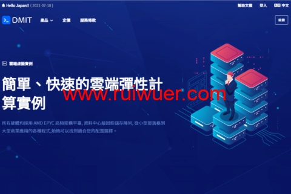

# DMIT Tokyo CN2 GIA VPS: 50% Off Annual Plans Starting at $119/Year

Looking for a reliable Japan VPS with premium network routes to China? DMIT's Tokyo CN2 GIA lineup offers the same infrastructure rumored to power Bandwagon Host's Japan services—combining CN2 GIA, China Unicom 10099, and CMI routes for stable cross-border connectivity.

---

## What Makes DMIT Tokyo Worth Considering

DMIT relaunched their annual discount for Tokyo CN2 GIA plans (branded as **PVM.TYO.Pro series**), cutting prices by 50% for up to three billing cycles. This isn't just another promotional gimmick—these servers share the same premium peering that powers some well-known providers' Japan offerings.

The network routing breaks down like this:
- **China Telecom**: CN2 GIA direct routes
- **China Unicom**: VIP 10099 + 9929 premium backbone
- **China Mobile**: Direct connection via CMI

Since launching in 2017, DMIT has built a reputation around two things: network quality and uptime reliability. Their Los Angeles CN2 GIA plans already attract users who need consistent performance, and this Tokyo expansion follows the same approach—premium routes without the usual congestion you'd see on regular BGP connections.

## Current Promotion Details

**Discount Code**: `Special-Annual-50off-Replace-IP-Restricted-To-Once-Per-30-Days`

**What you get**:
- 50% off for 3 consecutive annual cycles (stack up to 3 years)
- Annual billing only
- Applies to STARTER, MINI, MICRO, and MEDIUM plans (excludes TINY base tier)

**Trade-offs to know**:
- IP replacement limited to once per 30 days ($5 fee per change)
- Standard IP replacement policy in ToS doesn't apply
- No 1.3x traffic bonus typically included with annual billing

Existing customers can contact support to convert current subscriptions, but the IP replacement restrictions apply immediately upon conversion.

If you're evaluating VPS options for cross-border projects that need consistent latency to mainland China, comparing different CN2 GIA providers becomes crucial. 👉 [Check how DMIT's Tokyo routes stack up against other Asia-Pacific CN2 options](https://www.dmit.io/aff.php?aff=13832)

The infrastructure handles typical use cases well—whether you're running API endpoints that serve users across Asia, hosting regional game servers, or managing content delivery that requires predictable performance to China without constant packet loss.

## Available Plan Configurations

All plans run on KVM virtualization with these baseline specs:
- 100Mbps bandwidth
- 1 IPv4 + 1 IPv6 /64 subnet
- Triple-route coverage: CN2 GIA/Unicom 10099(9929)/CMI

**Plan tiers** (remember, TINY tier excluded from discount):

- **STARTER**: 1 CPU core / 1.5GB RAM / 20GB SSD / 500GB monthly traffic - **$119/year** (before discount: $238)
- **MINI**: 1 core / 2GB RAM / 40GB SSD / 1TB traffic - **$169/year** (before discount: $338)  
- **MICRO**: 2 cores / 2GB RAM / 60GB SSD / 1.5TB traffic - **$239/year** (before discount: $478)
- **MEDIUM**: 2 cores / 4GB RAM / 80GB SSD / 2TB traffic - **$359/year** (before discount: $718)

Each tier includes upgrade options through support tickets if you need additional resources beyond the standard configurations. The 100Mbps bandwidth ceiling works fine for most workloads, though if you're pushing significant sustained traffic, you'll want to factor that into your planning.

For projects that combine Tokyo hosting with Los Angeles presence, cross-region setups benefit from having both locations on similar network quality. 👉 [Explore DMIT's full data center coverage including LAX CN2 GIA options](https://www.dmit.io/aff.php?aff=13832)

**Test IP**: Available through official channels for latency verification before purchasing

---

## Why This Matters for Cross-Border Hosting

The real value here isn't just "another Japan VPS"—it's about having predictable routing when your traffic crosses into mainland China. Regular international BGP routes can see massive latency spikes during peak hours or suffer from packet loss that kills user experience.

CN2 GIA solves this by using China Telecom's premium backbone that sidesteps congestion points. Combined with Unicom's 10099/9929 routes and Mobile's CMI connection, you get redundancy across all three major carriers without manual failover configuration.

This setup particularly suits:
- **API services** where response time consistency matters more than raw throughput
- **Gaming infrastructure** that can't tolerate jitter or packet loss
- **Content delivery** requiring stable performance across different Chinese ISPs
- **Development environments** where developers in both regions need reliable access

DMIT's track record since 2017 shows they understand the difference between advertising premium routes and actually maintaining them. Their LA CN2 GIA plans already demonstrate this—users report stable performance even during traditional congestion windows like Chinese New Year when international bandwidth typically degrades.

The Tokyo addition makes sense because Japan's proximity to China means lower baseline latency compared to US West Coast, while still maintaining the same route quality that matters for cross-border reliability.

---

## Bottom Line

At $119/year after the 50% discount, DMIT's Tokyo CN2 GIA starter plan puts premium China-optimized routing within reach for projects that previously might have settled for standard international connectivity. The three-year discount stacking means you can lock in this pricing through 2027 if the infrastructure meets your needs.

The IP replacement restrictions won't matter unless you frequently need to change addresses—most stable hosting scenarios rarely require this anyway. What matters more is whether the baseline route quality handles your traffic patterns, and DMIT's existing LA infrastructure suggests they maintain their networks properly rather than overselling capacity.

For anyone running services that bridge China and international users, having Tokyo as a regional hub with proper CN2 GIA connectivity removes a major pain point. Testing is straightforward since you can verify latency before committing to annual billing. [Explore DMIT's Tokyo CN2 GIA plans and compare configurations](https://www.dmit.io/aff.php?aff=13832) to find the right balance between resources and budget for your specific workload.
